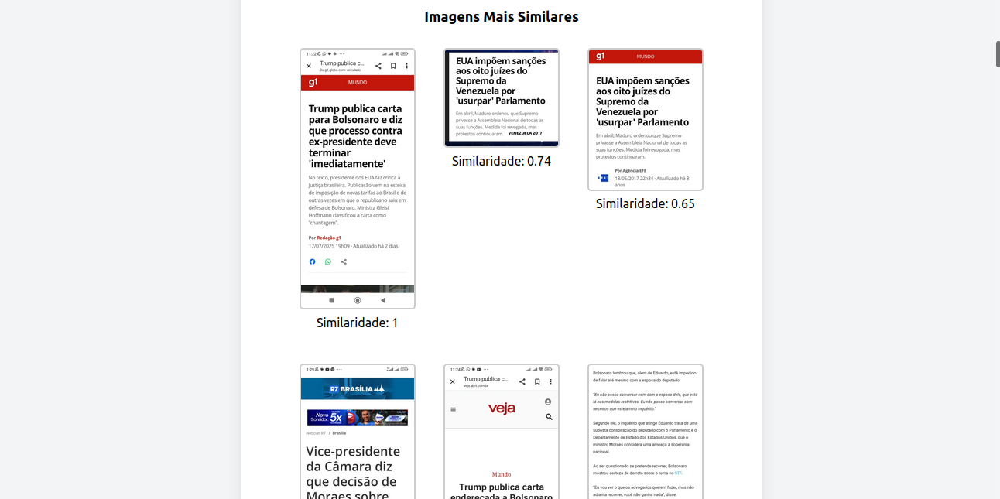

# Duplicate-Images-Removal

Aplicação FastAPI para detecção e remoção de imagens duplicadas de maneira semi-automática com suporte a CLIP embeddings, redução de dimensionalidade e indexação vetorial.




## Funcionalidades

- Upload de imagens via API;
- Processamento de imagens para extração de embeddings de maneira semântica;
- Redução de dimensionalidade dos embeddings gerados;
- Integração com banco de dados vetorial para armazenamento e busca de embeddings;  
- Comparação de embeddings para detecção de duplicatas; 
- Interface REST com endpoints para upload, verificação e remoção.  

## Instalação e Execução Local

1. Clone o repositório:  
   ```bash
   git clone https://github.com/PipInstallGustavo/Duplicate-Images-Removal.git
   cd Duplicate-Images-Removal
2. Crie ambiente virtual e instale dependências:
```bash
    python -m venv venv
    source venv/bin/activate     # em Linux/Mac
    # ou venv\Scripts\activate   # em Windows
    pip install -r requirements.txt
```

3. Crie a pasta "Docker" para o Milvus:
```bash
    mkdir docker
    cd docker
```

4. Baixe o Docker Compose do Milvus Standalone:
```bash
        wget https://github.com/milvus-io/milvus/releases/latest/download/milvus-standalone-docker-compose.yml -O docker-compose.yml
```

5. Coloque o docker-compose.yml dentro da pasta docker.

6. Entre dentro da pasta docker e rode o docker compose:


```bash 
    cd docker
    sudo docker compose up -d
    sudo docker compose ps # para checar se os contâineres estão rodando normalmente
    cd ..
```

7. Rode a aplicação:

```bash
    uvicorn main:app --reload
```